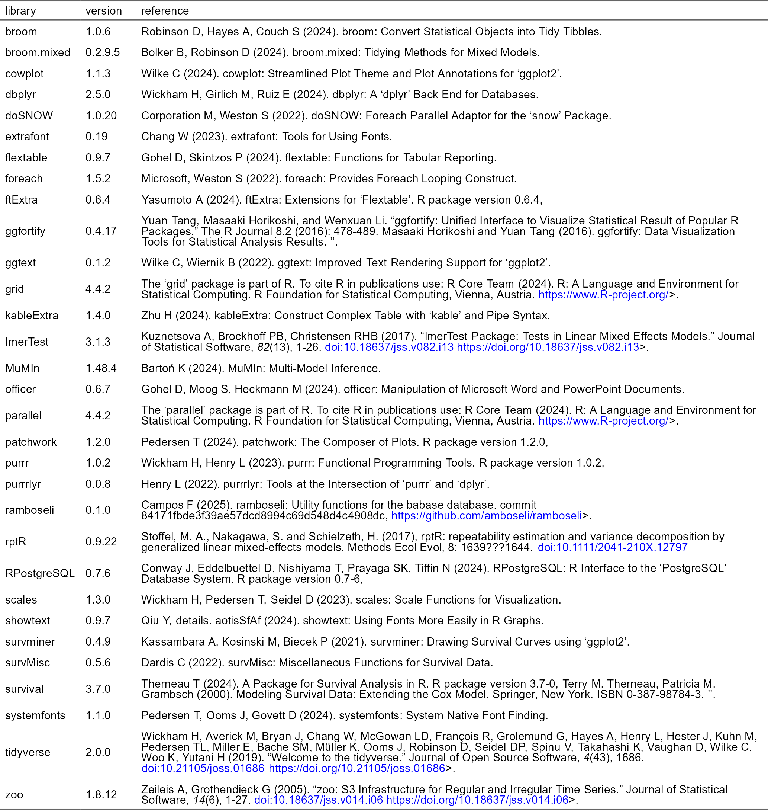

R packages
================

This is an overview of all the packages used for the Early-life paternal
relationships predict adult female survival in wild baboons paper.

The code in this repository was created by David Jansen  
Archie Lab; University of Notre Dame  
<david.awam.jansen@gmail.com>

The corresponding author of the paper is Elizabeth Archie
(<earchie@nd.edu>).

For your information the following code was used to load and/or install
packages into R.

And here is the code that was used to create the reference table.
